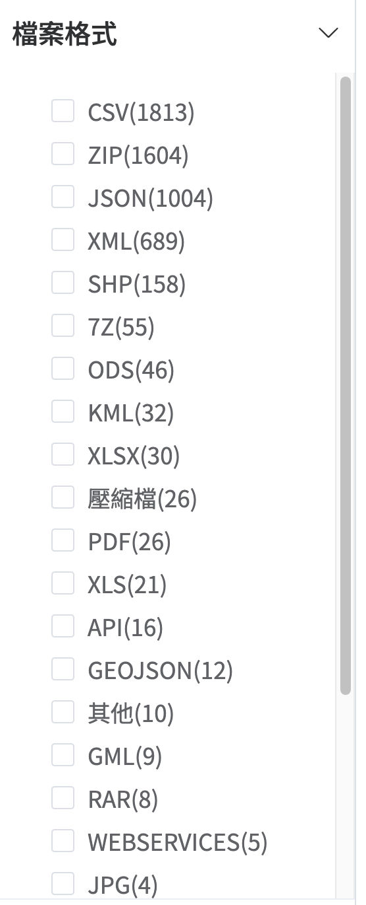
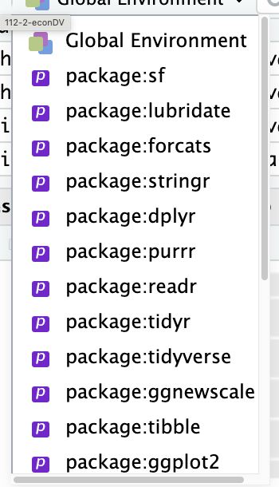

# Geographical Information Systems

## What is GIS?

A Geographic Information System (GIS) is a system designed to capture, store, manipulate, analyze, manage, and present spatial or geographic data. The acronym GIS is sometimes used for Geographic Information Science (GIScience) to refer to the academic discipline that studies geographic information systems and is a large domain within the broader academic discipline of geoinformatics. What goes beyond a GIS is a spatial data infrastructure, a concept that has no such restrictive boundaries.

## GIS in R: `sf` package

R has a number of packages for working with spatial data. The most important of these is the `sf` package, which provides a simple way to work with spatial data in R. The `sf` package is built on top of the `sp` package, which is the original spatial data package for R. The `sf` package is designed to be easier to use than the `sp` package, and it provides a more modern and consistent interface for working with spatial data.

[`sf` cheatsheet](https://github.com/rstudio/cheatsheets/blob/main/sf.pdf)

## GIS Data Types

[](https://data.gov.tw/datasets/search?p=1&size=10&s=_score_desc&rft=%E5%9C%B0%E5%9C%96)

# AI assistant

AI》  

> ```You are an assistant to data visualization. You use R in tidyverse style for assistance. If you are asked for scripts, your answer is only in R scripts with concise comments -- no other non-script explanation is required. The first line of your code chunk must be a comment line. Its format is `# {{summary_title}} -----` where `{{summary_title}}` is your short summary of the assisted task. Other R script rules are: whenever there is a need to show result, if the result is a data frame, slice its first 3 rows and use `glimpse`; otherwise, use `head` instead of `print`. ```


> ```For plotting, always use `theme_minimal`. The x-axis line should be a solid black. If creating a new plot, always create a plot object and show it. If adding layers to an existing plot, always show the plot after adding each layer. A plot should always have a title, and a subtitle to show the unit of y axis. In addition, there should be a footnote showing data source.```

> ```For geographical data, always use `geom_sf` for plotting unless impossible. When simplifying simple features, always use `st_simplify` with `preserveTopology = TRUE` and `dTolerance =1`.```

> ```If you understand your role, say it -- no need to show any code at this time.```


# GIS plottiing

## Simple Feature

Simple Feature是一種空間資料的結構，包含以下幾何類型：  

  - 點（point）：   
  - 連線（line string）  
  - 多邊體（polygon）  
  - 多點（multipoint）  
  - 多連線（multilinestring）  
  - 多多邊體（multipolygon）
  
另外還有：

  - bounding box: 空間資料的邊界框
  - CRS (coordinate reference system): 空間資料的座標參考系統
  
### shp file

一組shp檔案通常包含以下幾個檔案：

- .shp：包含幾何形狀的檔案
- .shx：包含幾何形狀的索引檔案
- .dbf：包含屬性資料的檔案

等等，這群檔案要放在同一資料夾下，才能正確讀取。

AI》
> ```How to read shp file```

### 簡化空間資料

  - 保留拓撲關係（preserve topology）：`preserveTopology = TRUE`  
  - 簡化容錯（tolerance）：`dTolerance = 1` ，值越大，簡化程度越高

AI》
> ```How to simplify simple features```


### sf 引入順序



> 留意sf要在最靠近Global environment的位置，至少比dplyr還要靠近。

### OpenStreetMap

[Open Steet Map](https://tpemartin.github.io/economic-data-visualization/zh-tw/annotation-and-maps.html#open-street-map-osm)

AI》
> ```How to download simple feature from  OpenStreetMap```

## `geom_sf`

ggplot主要用`geom_sf`來處理地點圖層，不用`geom_point`、`geom_polygon`等，data input必需是只帶有一種基本幾何的data frame, 稱為simple feature (data frame). 如果有多幾基本幾何則使用多層`geom_sf`來層疊，只需記得

> 每一層所使用的simple feature只帶有一種基本幾何。

。`geom_sf`是`sf`套件的一部分，用來處理空間資料。`sf`套件是`sp`套件的後繼者，用來處理空間資料。`sf`套件的資料結構是`sf`，`sp`套件的資料結構是`sp`。`sf`套件的資料結構是`data.frame`，`sp`套件的資料結構是`Spatial`。`sf`套件的資料結構是`data.frame`，所以可以用`dplyr`套件的函數來處理資料。`sp`套件的資料結構是`Spatial`，所以不能用`dplyr`套件的函數來處理資料。

## 範例程式1

```r
library(tidyverse)
# Reading a shapefile -----
shapeData <- st_read("COUNTY_MOI_1090820.shp")
glimpse(shapeData)

class(shapeData)

# Simplifying shapeData simple feature -----
simplified_shape <- st_simplify(shapeData,
                                preserveTopology = TRUE, 
                                dTolerance = 2)
glimpse(simplified_shape)

ggplot()+
  geom_sf(
    data=simplified_shape
  )

# Obtaining bounding box -----
bbox <- st_bbox(simplified_shape)
bbox

bbox["ymin"] <- 21

simplified_shape <- 
  st_crop(simplified_shape,
          bbox)

ggplot()+
  geom_sf(
    data=simplified_shape
  )

object.size(simplified_shape)

# Filtering out COUNTYNAME = "新北市" -----
simplified_shape2 <- simplified_shape %>% 
  filter(COUNTYNAME == "新北市")
class(simplified_shape2)

ggplot()+
  geom_sf(
    data=simplified_shape2,
    fill="red",color="blue",
    linewidth=2
  )

# Creating a column "zone" with random assignment -----
set.seed(123)  # Setting seed for reproducibility
simplified_shape <- simplified_shape %>%
  mutate(zone = sample(c("north", "south", "east", "west"), size = n(), replace = TRUE))
glimpse(simplified_shape)

ggplot()+
  geom_sf(
    data=simplified_shape,
    mapping=aes(
      fill=zone
    )
  )

# Plotting simplified_shape with filled color determined by zone column -----
plot <- ggplot(simplified_shape) +
  geom_sf(aes(fill = zone)) +
  theme_minimal() +
  scale_fill_manual(values = c("north" = "blue", "south" = "green", "east" = "red", "west" = "yellow")) +
  labs(title = "Simplified Shape with Zone Coloring", subtitle = "Zone") +
  theme(legend.position = "bottom") +
  theme(legend.title = element_blank()) +
  theme(legend.text = element_text(size = 8)) +
  theme(axis.line.x = element_line(color = "black", size = 0.5)) +
  labs(caption = "Data Source: your_source")

print(plot)
```