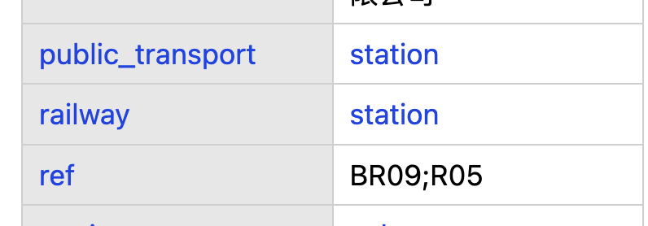
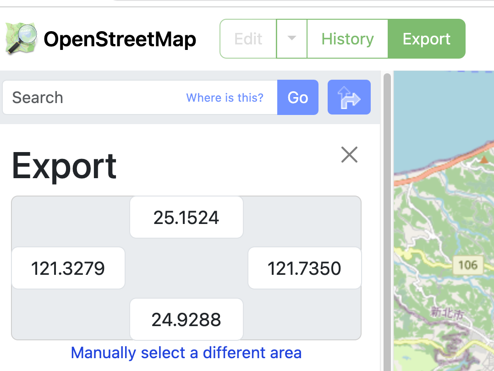

# OpenStreetMap


[Open Steet Map](https://tpemartin.github.io/economic-data-visualization/zh-tw/annotation-and-maps.html#open-street-map-osm)

AI》
> ```How to download simple feature from  OpenStreetMap```

## Query Features


## Locate Feature Key-value



## Set Bounding Box



## 範例程式

```r

# OSM -----
# Request subway railway data from OpenStreetMap within specified bounding box
library(osmdata)

# Define bounding box coordinates
bbox <- c(121.4044, 25.1863, 121.7999, 25.0072)

# Construct query
query <- opq(bbox) %>%
  add_osm_feature(key = "railway", value = "subway")

# Get data
osm_data <- osmdata_sf(query)

# geometry lines
mrt <- osm_data$osm_lines

library(tidyverse)
mrt |>
  ggplot()+geom_sf()

# Taiwan sf
library(tidyverse)
library(sf)

# Reading a shapefile -----
shapeData <- st_read("COUNTY_MOI_1090820.shp")

# Simplifying shapeData simple feature -----
simplified_shape <- st_simplify(shapeData,
                                preserveTopology = TRUE, 
 
                                         dTolerance = 2)

simplified_shape |>
  filter(
    COUNTYNAME %in% c(
      "臺北市", "新北市"
    )
  ) |>
  ggplot() + geom_sf() +
  geom_sf(
    data=mrt
  )

bbox0 <- st_bbox(simplified_shape)
bbox0["xmin"] <- 121.0
bbox0["ymax"] <- 25.35
bbox0["xmax"] <- 121.7999
bbox0["ymin"] <- 24.9

simplified_shape_crop <- sf::st_crop(simplified_shape, 
                                     bbox0)

simplified_shape_crop |>
  ggplot()+
  geom_sf() +
  geom_sf(
    data=mrt
  )


# econDV2 ------

mp <- econDV2::Map()
mp$sf$get_sf_taiwan_simplified() -> taiwan
taiwan$台灣本島$鄉鎮區 -> sf_township

sf_township |>
  ggplot()+
  geom_sf()

```