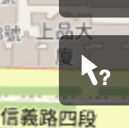

# OpenStreetMap


[Open Steet Map](https://tpemartin.github.io/economic-data-visualization/zh-tw/annotation-and-maps.html#open-street-map-osm)

AI》
> ```How to download simple feature from  OpenStreetMap```

## Query Features



## Locate Feature Key-value


## Set Bounding Box

