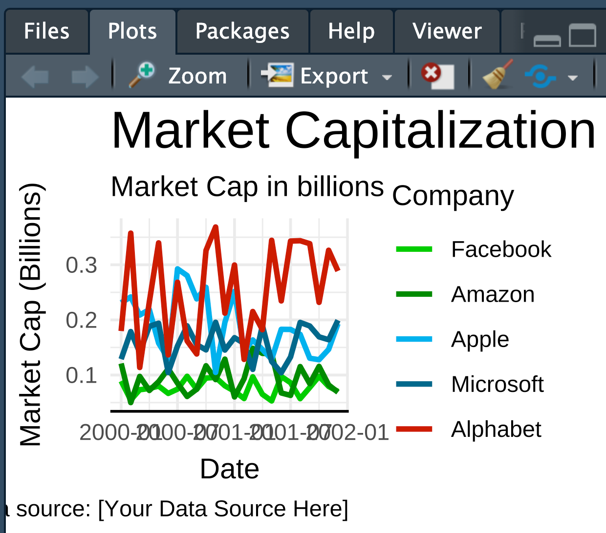
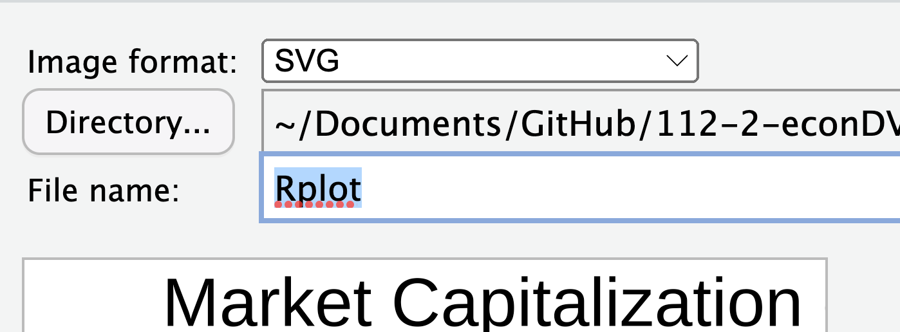
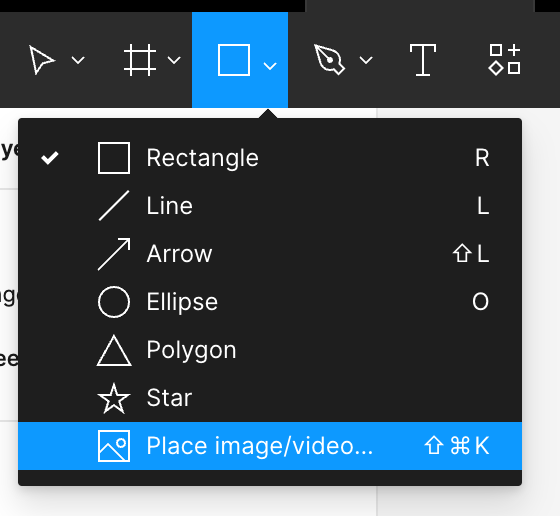
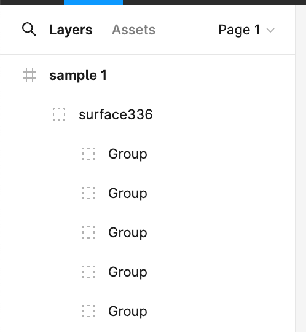
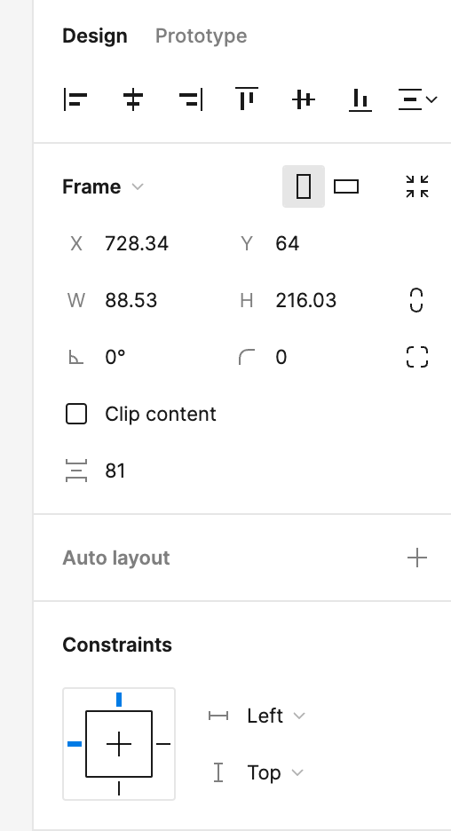
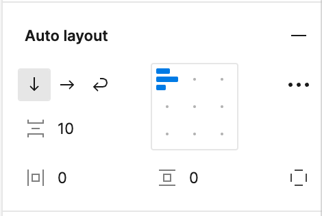
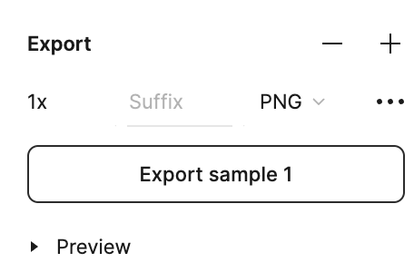

# 後製

```r
# Trillion-dollar tech plot example -----
library(tidyverse)

# Create example data frame
set.seed(123)
date_seq <- seq.Date(from = as.Date("2000-01-01"), to = as.Date("2001-12-01"), by = "month")
data <- tibble(
  date = date_seq,
  Microsoft = runif(length(date_seq), 0.1, 0.2),
  Apple = runif(length(date_seq), 0.1, 0.3),
  Alphabet = runif(length(date_seq), 0.1, 0.4),
  Amazon = runif(length(date_seq), 0.05, 0.15),
  Facebook = runif(length(date_seq), 0.05, 0.1)
)

# Transform data for plotting
data_long <- data %>%
  pivot_longer(cols = -date, names_to = "company", values_to = "market_cap")

# Define custom colors for each company based on the given rules
custom_colors <- c(
  "Alphabet" = "red3",
  "Microsoft" = "deepskyblue4",
  "Apple" = "deepskyblue2",
  "Amazon" = "green4",
  "Facebook" = "green3"
)

# Ensure proper ordering of colors based on the rules
ordered_companies <- c("Facebook", "Amazon", "Apple", "Microsoft", "Alphabet")

# Plotting market capitalization over time for different companies
market_cap_plot <- data_long %>%
  mutate(company = factor(company, levels = ordered_companies)) %>%
  ggplot(aes(x = date, y = market_cap, color = company)) +
  geom_line(
    size=1 #input$size
  ) +
  scale_color_manual(values = custom_colors) +
  labs(
    title = "Market Capitalization of Different Companies Over Time",
    subtitle = "Market Cap in billions",
    x = "Date",
    y = "Market Cap (Billions)",
    color = "Company",
    caption = "Data source: [Your Data Source Here]"
  ) +
  theme_minimal() +
  theme(axis.line.x = element_line(color = "black"),
        plot.title = element_text(
          size = 20 #input$title
        ))

market_cap_plot
```

## 輸出SVG

### 使用視窗選擇（不推薦）

Export


Save as SVG


### 使用程式

先安裝svglite套件

```r
install.packages("svglite")
```

然後執行以下程式碼
```r
ggsave("test2.svg", market_cap_plot, width=700, height=500, units="px", dpi="screen", device=svg)
```

# Figma

## 引入SVG 



## 疊層選擇

左側疊層Layers選單


選了之後可以幹嘛？

  - Group vs. Frame (問AI)

## Design 

右側針對選擇的疊層可以做的事情: 


### Auto layout in Frame



### Export

