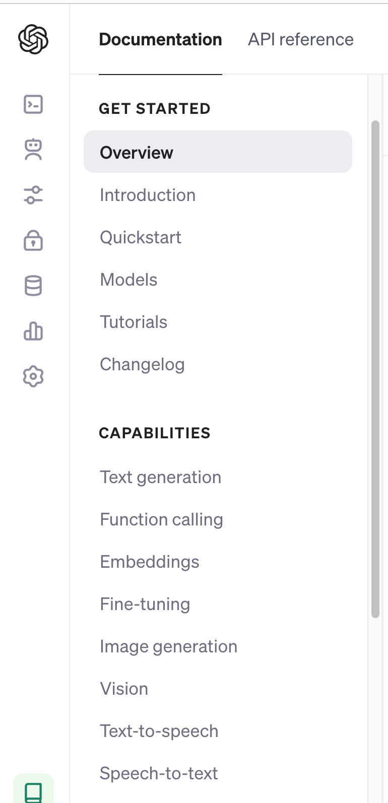

# Bar chart

## Claude AI
 
- <https://claude.ai/>

當ChatGPT-3.5不能滿足你，你又沒有GPT-4可用，你可以使用Claude AI來生成範例圖表。


## 基本圖型

- <https://www.economist.com/graphic-detail/2024/02/12/the-economists-cost-of-loving-index>

### Key concept: (AI)請AI描述再生成範例程式

AI> (Claude page mode)
```
describe the graph here
```

AI> (Claude page mode)
```
所有回答使用到程式時一律使用R, 並盡量使用tidyverse語法, 程式產生的最終結果儘量收錄在環境中已有的list物件results中，答案以R script呈現
```
## X軸為unordered factor

### Key concept: X軸為unordered factor時，bar chart的順序要注意

> 必需依照Y軸的值排序

- `reorder(cities, cost)`

## fill美學的位置

- Dodge (default，躲避)
- Stack（堆叠）
- Fill (填滿100%)

### Key concept: (AI)善用AI生成範例圖表

AI> 
```
Follow the grammar of graphics:
- Layer 1:
  - geom: bar
  - aesthetics:
    - x: category from 1 to 4
    - y: value
    - fill: category from A to C

給我示範dodge, stack, fill三種positions的範例程式
```

## Vision AI 



- <https://platform.openai.com/docs/guides/vision>

### Use Vision AI in RStudio

#### Setup Python in RStudio
To create a Python environment with a specific interpreter path using Conda through the `reticulate` package in RStudio, you can follow these steps:

1. **Install the 'reticulate' Package**: If you haven't already installed the `reticulate` package, you can do so by running the following command in RStudio:

```R
install.packages("reticulate")
```

2. **Load the 'reticulate' Package**: After installation, load the `reticulate` package into your R session:

```R
library(reticulate)
```

3. **Create a Conda Environment with Specific Interpreter Path**: You can create a Conda environment with a specific Python interpreter path using the `conda_create()` function. Pass the path to the interpreter using the `python` argument. For example:

```R
conda_create(envname = "my_env", python = "/path/to/python/interpreter")
```

Replace `"/path/to/python/interpreter"` with the actual path to your Python interpreter.

4. **Activate the Conda Environment**: Once the environment is created, you need to activate it. This can be done using the `use_condaenv()` function from `reticulate`.

```R
use_condaenv("my_env", required = TRUE)
```

Replace `"my_env"` with the name of your Conda environment.

5. **Verify Environment Activation**: You can check if the environment is activated by running the following command:

```R
conda_list()
```

This will list the packages installed in the currently active environment.

6. **Use Python Code**: Now you can use Python code within RStudio, and it will use the specific interpreter path you specified when creating the environment.

By following these steps, you can create a Python environment with a specific interpreter path and use it within RStudio seamlessly using the `reticulate` package.

#### Pip install in RStudio

```R
reticulate::py_install("openai", pip=T)
```

#### Image description

```python
from openai import OpenAI

client = OpenAI(api_key = "...")

response = client.chat.completions.create(
  model="gpt-4-vision-preview",
  messages=[
    {
      "role": "user",
      "content": [
        {"type": "text", "text": "What’s in this image?"},
        {
          "type": "image_url",
          "image_url": {
            "url": "https://www.economist.com/cdn-cgi/image/width=360,quality=80,format=auto/content-assets/images/20240323_EPC824.png"
            },
        },
      ],
    }
  ],
  max_tokens=300,
)

print(response.choices[0])
```

#### Description Created Graph Example

AI>
```
Create an example dataframe with graphing codes that can generate a graph fitting the description: 'The image shows a bar chart titled "That rich taste," which presents data on worldwide market capitalization of selected categories of generative-AI businesses, in billion dollars ($bn). The chart compares the market capitalization on two dates: October 1st, 2022, and March 15th, 2024.\n\nThere are four categories listed:\n\n1. Cloud-computing companies\n2. Hardware companies\n3. Software applications\n4. Modelmakers\n\nFor each category, there are two bars indicating the market capitalization on the two respective dates, showing growth or changes between the two dates. The chart also includes a footnote which states, "Most recent funding round before the release of ChatGPT," indicating that the asterisk next to the 0.03 figure for Modelmakers refers to the most recent funding round before ChatGPT\'s release.\n\nOn the right-hand side of the chart, there are numbers indicating the number of companies surveyed in each category:\n\n- Cloud-computing companies: 3\n- Hardware companies: 27\n- Software applications: 19\n- Modelmakers: 11\n\nThe sources for the data are listed as Bloomberg, PitchBook, news reports, company reports, and The Economist.'
```

### 範例程式

```R
# Cost of Loving Index ----

## create results list -----
results <- list()

## example data ----
# Load required packages
library(tidyverse)

# Read data from image into a data frame
cost_of_loving <- data.frame(
  City = c("Shanghai", "New York", "Bahrain*", "Los Angeles", "Paris", 
           "Amman", "Caracas", "Moscow", "Milan", "Beijing", 
           "Barcelona", "St Petersburg", "Abu Dhabi", "Düsseldorf", "Zurich"),
  `Two-course meal for two people*` = c(548, 408, 388, 328, 308, 288, 288, 288, 288, 268, 248, 248, 248, 228, 228),
  `Bottle of fine wine†` = c(108, 108, 88, 88, 88, 68, 68, 68, 68, 48, 48, 48, 48, 48, 48),
  `Two drinks at a hotel bar` = c(60, 60, 40, 40, 40, 40, 40, 40, 40, 40, 40, 40, 40, 40, 40),
  `Two cinema tickets` = c(28, 32, 24, 28, 32, 24, 16, 24, 24, 24, 28, 16, 28, 28, 32),
  `Initial taxi meter charge` = c(8, 8, 6.5, 6, 8, 4, 2, 4, 8, 4, 8, 4, 8, 8, 12)
)

# Calculate total cost
cost_of_loving <- cost_of_loving %>%
  mutate(Total = rowSums(.[2:6]))

# Sort by total cost in descending order
cost_of_loving <- cost_of_loving %>%
  arrange(desc(Total))

# Store results in a list
results <- list(cost_of_loving = cost_of_loving)

df <- cost_of_loving %>%
  pivot_longer(cols = -c(City, Total), 
               names_to = "Category", 
               values_to = "Cost") 
## create bar chart ----
# Create a bar chart
bar_chart <- df %>%
  ggplot(aes(x = reorder(City, Total), y = Cost, fill = Category)) +
  geom_col() +
  coord_flip() +
  labs(title = "Cost-of-Loving Index: Top 15 Most Expensive Cities in 2023",
       x = "City",
       y = "Cost (USD)") +
  scale_fill_discrete(name = "Category") +
  theme_minimal()

# Store bar chart in results list
results$bar_chart <- bar_chart

```

## 練習檔案程式碼

```R
library(tidyverse)

# 定義每個學年的 CSV 下載按鈕對應的網址
csv_urls <- list(
  "104學年" = "https://stats.moe.gov.tw/files/ebook/native/104/104native_A1-1.csv",
  "105學年" = "https://stats.moe.gov.tw/files/ebook/native/105/105native_A1-1.csv",
  "106學年" = "https://stats.moe.gov.tw/files/ebook/native/106/106native_A1-1.csv",
  "107學年" = "https://stats.moe.gov.tw/files/ebook/native/107/107native_A1-1.csv",
  "108學年" = "https://stats.moe.gov.tw/files/ebook/native/108/108native_A1-1.csv",
  "109學年" = "https://stats.moe.gov.tw/files/ebook/native/109/109native_A1-1.csv",
  "110學年" = "https://stats.moe.gov.tw/files/ebook/native/110/110native_A1-1.csv",
  "111學年" = "https://stats.moe.gov.tw/files/ebook/native/111/111native_A1-1.csv",
  "112學年" = "https://stats.moe.gov.tw/files/ebook/native/112/112native_A1-1.csv"
)

# 將結果存入results中
results <- list(csv_urls = csv_urls)

## download and import ----
# 建立一個空的list來存儲下載的資料
data_list <- list()

# 循環下載每個CSV檔案並讀取到R中
for (year in names(csv_urls)) {
  # 下載CSV檔案
  download.file(csv_urls[[year]], paste0(year, ".csv"))
  
  # 讀取CSV檔案
  data <- read.csv(paste0(year, ".csv"))
  
  # 將讀取的資料存入data_list中
  data_list[[year]] <- data
}

# 將結果存儲在環境中已有的list物件results中
results$data_list <- data_list

library(purrr)
library(dplyr)

# 使用imap()函數向每個DataFrame添加"學年度"欄位
data_list <- imap(data_list, ~ mutate(.x, 學年度 = as.integer(gsub("\\D", "", .y))))

# 將結果存儲在環境中已有的list物件results中
results$data_list_with_year <- data_list

# merge ----
library(dplyr)

# 垂直合併data_list中的每個DataFrame
combined_data <- bind_rows(data_list)

# 將結果存儲在環境中已有的list物件results中
results$combined_data <- combined_data
``` 

### Prompt

AI>
```
combined_data有以下欄位：
- "學校名稱": character class
- "在學學生人數_博士班": integer
- "在學學生人數_碩士班": integer
- "在學學生人數_學士班": integer
- "學年度": integer

晝一個圖
 - geom: bar
   - aes:
     - x: 學年度
     - y: 在學學生人數
     - fill: 學制（博士班、碩士班，或學士班）
呈現不同學年各學制在該年的人數佔比
```

