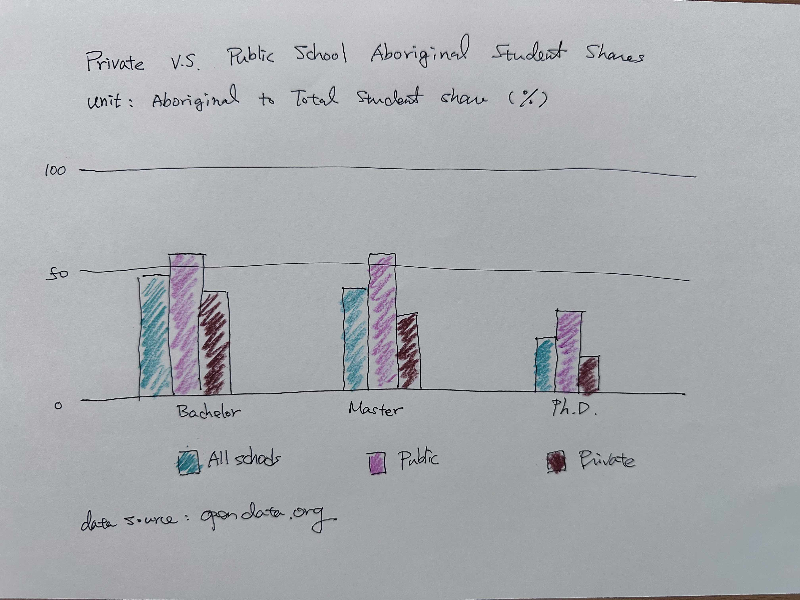

# 製圖策略

## AI Preset

AI>
```
所有問題都是針對RStudio的環境進行設定, 回答使用到程式時一律使用R, 並盡量使用tidyverse語法, 答案以R script呈現
```

## 任務確認

AI》（任務確認）
> (...) 請先以流暢的文字描述任務，無需有程式碼。

 - 請AI重新描述一次有助於確定任務沒被誤解

- 若不確定AI的描述是否正確，可以請它給個範例。

 
### 有誤解的任務

AI》
> 將df欄位中的"博士班","碩士班","學士班"加總，df欄位中"學校類別"變成' 大專院校'，使得呈現'大專院校'對應"博士班","碩士班","學士班"。

改成

AI》
> 將df欄位中的"博士班","碩士班","學士班"加總，df欄位中"學校類別"變成' 大專院校'，使得呈現'大專院校'對應"博士班","碩士班","學士班"。請先以流暢的文字描述任務，無需有程式碼。

### 可請AI給個範例

AI》（任務描述確認）
> 給個符合任務df格式的資料範例，並以markdown table顯示。
 
### 重新描述任務

AI》
> `df`是個dataframe裡頭有
> - `博士班`欄位代表博士班學生人數
> - `碩士班`欄位代表碩士班學生人數
> - `學士班`欄位代表學士班學生人數
> - `學校類別`欄位  
> 請計算學校類別為"大專院校"的學生總人數


## 資料觀察

112學年的資料：

- [大專校院原住民學生及畢業生人數—按等級別與校別分](https://data.gov.tw/dataset/33514)  
- [大專院校校別學生數](https://data.gov.tw/dataset/6231)

經整理可以得到以下兩個csv檔：

[大專院校各學制原住民學生數-112.csv](https://raw.githubusercontent.com/tpemartin/112-2-econDV/main/data/%E5%A4%A7%E5%B0%88%E9%99%A2%E6%A0%A1%E5%90%84%E5%AD%B8%E5%88%B6%E5%8E%9F%E4%BD%8F%E6%B0%91%E5%AD%B8%E7%94%9F%E6%95%B8-112.csv)
[大專院校各學制學生數-112.csv](https://raw.githubusercontent.com/tpemartin/112-2-econDV/main/data/%E5%A4%A7%E5%B0%88%E9%99%A2%E6%A0%A1%E5%90%84%E5%AD%B8%E5%88%B6%E5%AD%B8%E7%94%9F%E6%95%B8-112.csv)

## 手繪初圖



 - 英文判讀準備度高  
 - 可先寫好主標題，副標題，及資料出處

## AI取得範例程式碼

> 直方圖y=0應該要觸碰到x軸。

> ggplot語法，風貌設定層（ggplot, geom_XXX 以外）後面加上的如果和前面有相同函數，則覆蓋前面的設定。

## 銜接圖形的資料處理

# x軸


# 時間軸

