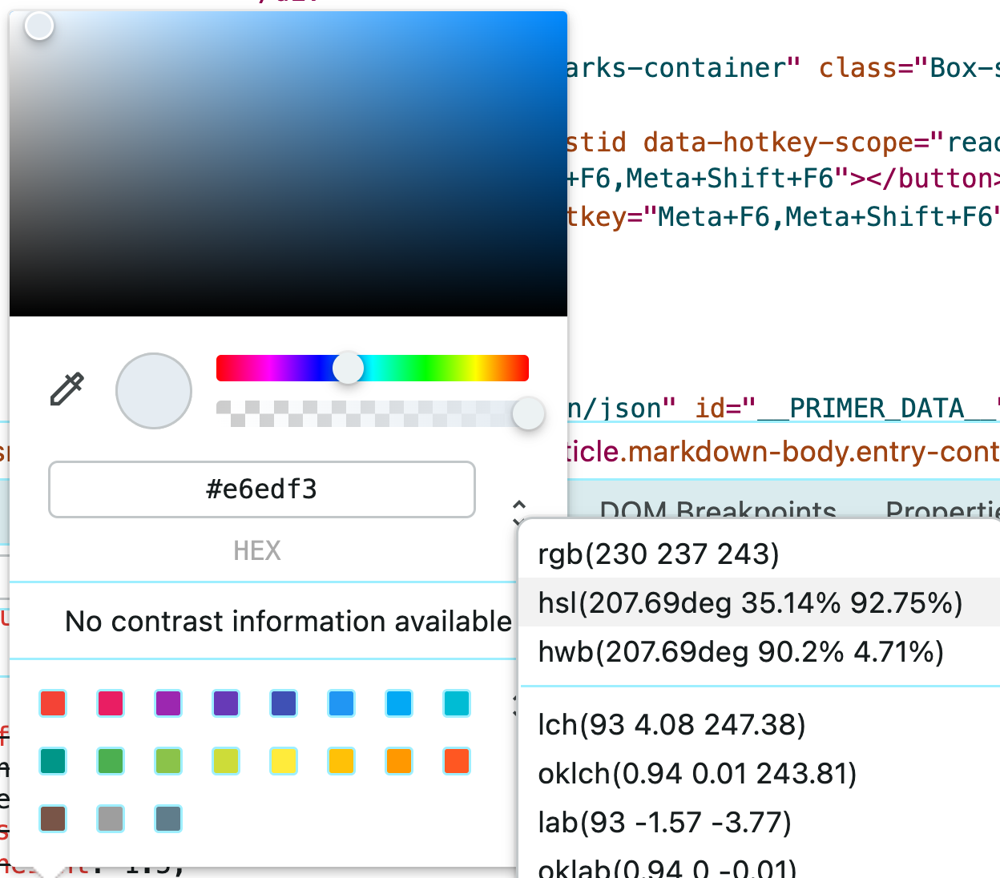
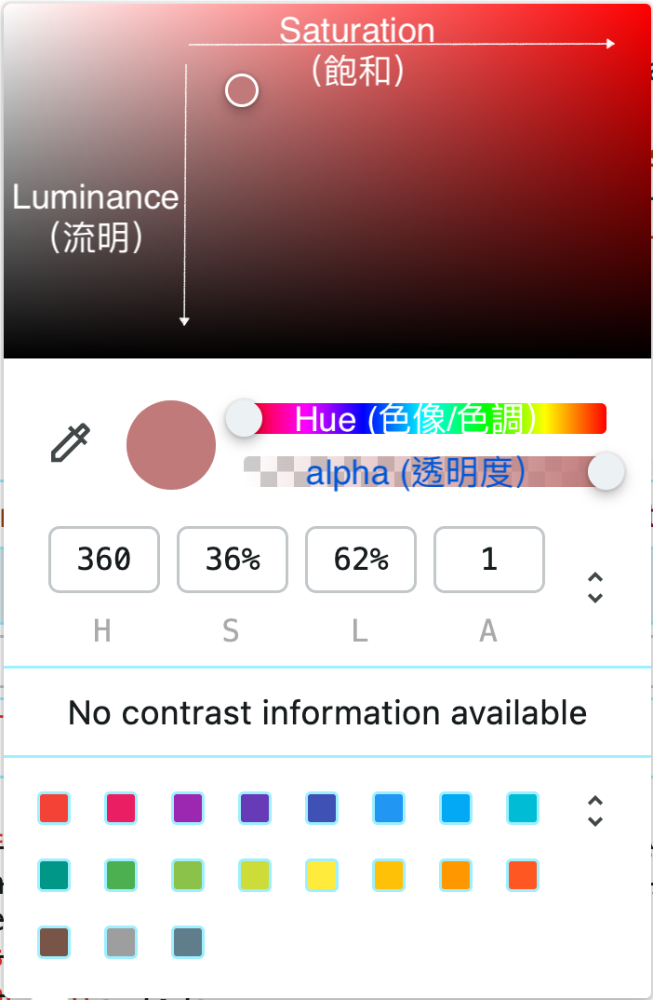
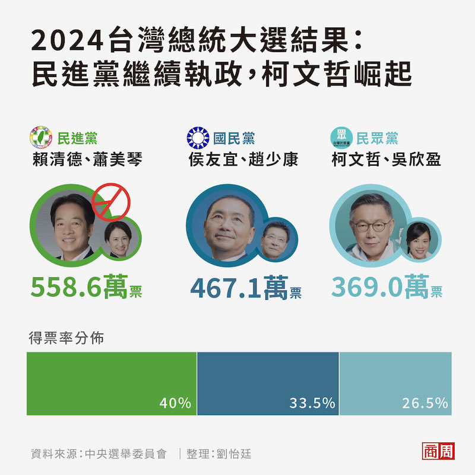
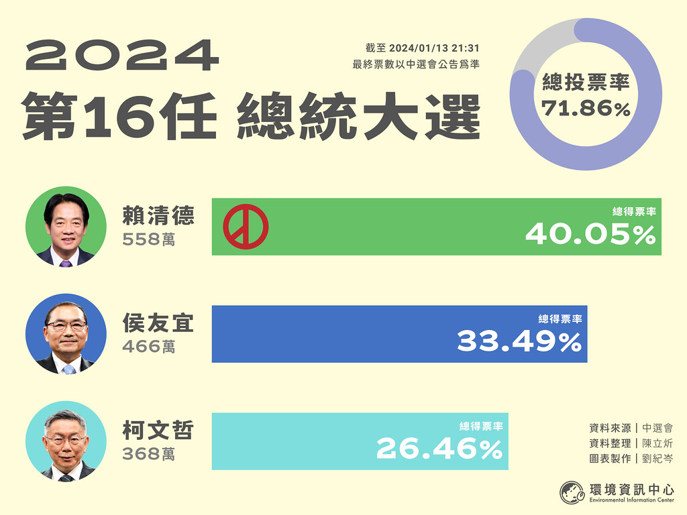
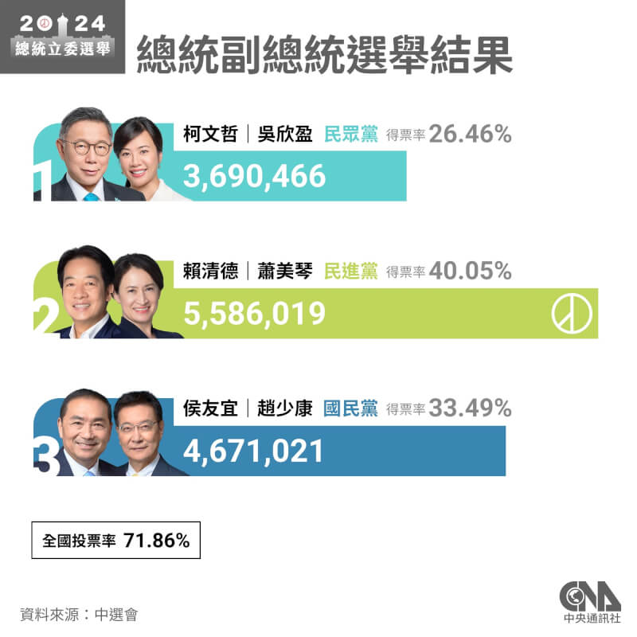

# Color/Fill Aesthetics

## AI preset

AI》
> 回答程式問題時一律使用R, 並盡量使用tidyverse語法, 答案以R script呈現

## Color space model

AI》
> What are the common color space models?

## Chrome inspector

AI》
> How to use Chrome inspector to get color code?

### explore HSL

#### color picker



#### HSL space



## Brewer palette

- <https://r-graph-gallery.com/38-rcolorbrewers-palettes.html>

## Qualitative

### 圖1



### 圖2




### 圖3



### AI design

AI》
> Create a bar chart with: title "2024 presidential election", subtitle "unit: percentage", x-axis has three candidates: "candidate A", "candidate B", and "candidate C", y-axis is their supporting rate which are 40.05, 33.49 and 26.45 respectively. y-axis should have no expansion. Save the plot in `myPlot` object.
>

 - y-axis should have no exapansion.

#### `+` operator in ggplot2

In ggplot2, to change or override the default settings, we can use `+` operator to add new settings.

AI》
> From now on, use `+` to modify `myPlot` object when applicable in a new task.

##### change fills

AI》
> - Change fill color so that candidate fills are #67c167, #4372c4 and #7ededd. 

#### y title on top left

#### remove fill legend

#### 範例程式

```r
# initial plot ----
# 讀取tidyverse套件
library(tidyverse)

# 建立資料框
data <- tibble(
  candidate = c("candidate A", "candidate B", "candidate C"),
  supporting_rate = c(40.05, 33.49, 26.45)
)

# 建立長條圖
myPlot <- ggplot(data, aes(x = candidate, y = supporting_rate, fill = candidate)) +
  geom_bar(stat = "identity") +
  labs(title = "2024 presidential election", subtitle = "unit: percentage") +
  scale_y_continuous(expand = c(0, 0)) 

# 印出長條圖
print(myPlot)

# change fill -----
# 修改填充顏色
myPlot + 
  scale_fill_manual(values = c("candidate A" = "#67c167", "candidate B" = "#4372c4", "candidate C" = "#7ededd")) -> myPlot

 print(myPlot) 

```

## Sequential 


## Diverging