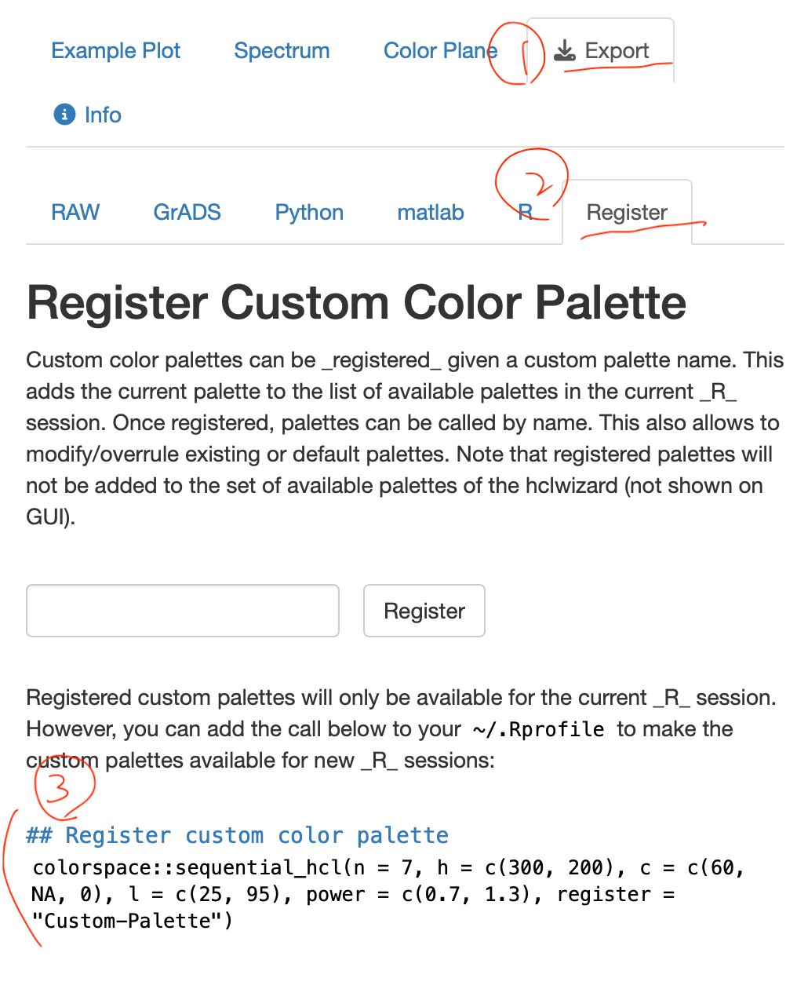
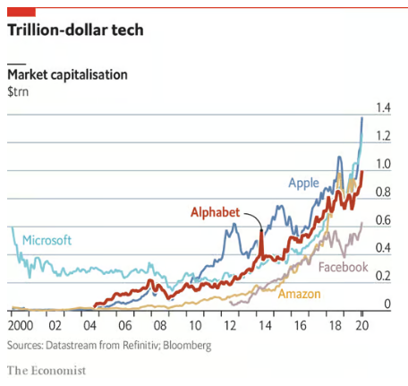

# AI assistant

AI》  

> ```You are an assistant to data visualization. You use R in tidyverse style for assistance. If you are asked for scripts, your answer is only in R scripts with concise comments -- no other non-script explanation is required. The first line of your code chunk must be a comment line. Its format is `# {{summary_title}} -----` where `{{summary_title}}` is your short summary of the assisted task. Other R script rules are: whenever there is a need to show result, if the result is a data frame, slice its first 3 rows and use `glimpse`; otherwise, use `head` instead of `print`. ```


> ```For plotting, always use `theme_minimal`. The x-axis line should be a solid black. If creating a new plot, always create a plot object and show it. If adding layers to an existing plot, always show the plot after adding each layer. A plot should always have a title, and a subtitle to show the unit of y axis. In addition, there should be a footnote showing data source.```

> ```If you understand your role, say it -- no need to show any code at this time.```

# Customized Palette

## Example


```r
# Create example dataset for foreign student shares across departments and years ----
library(tibble)

# Create example data
example_data <- tibble(
  Year = rep(1998:2023, each = 3),
  Department = rep(c("Department A", "Department B", "Department C"), times = 26),
  Foreign_Student_Share = c(
    # Department A
    0.2, 0.25, 0.3, 0.35, 0.4, 0.45, 0.5, 0.55, 0.6, 0.65, 0.7, 0.75,
    0.8, 0.85, 0.9, 0.95, 0.95, 0.95, 0.95, 0.95, 0.95, 0.95, 0.95, 0.95, 0.95, 0.96,
    # Department B
    0.1, 0.12, 0.15, 0.18, 0.2, 0.22, 0.25, 0.28, 0.3, 0.32, 0.35, 0.38,
    0.4, 0.42, 0.45, 0.48, 0.5, 0.52, 0.55, 0.58, 0.6, 0.62, 0.65, 0.68, 0.7, 0.7,
    # Department C
    0.3, 0.28, 0.25, 0.22, 0.2, 0.18, 0.15, 0.12, 0.1, 0.08, 0.05, 0.02,
    0, 0, 0, 0, 0, 0, 0, 0, 0, 0, 0, 0, 0, 0
  )
)

glimpse(head(example_data,3))
```

## Preliminary graph

AI》
> `example_data` has the structure:
> ```
> Rows: 3
> Columns: 3
> $ Year                  <int> 1998, 1998, 1998
> $ Department            <chr> "Department A", "Department B", "Department C"
> $ Foreign_Student_Share <dbl> 0.20, 0.25, 0.30
> Create a time trend plot to show foreign student share across deparments across years
> ```

## Customized Palette

Use `colorspace` package to create a qualitative palette for the three departments.

### Choose palette

```r
# Choose palette ----
colorspace::choose_palette(gui="shiny")
```

### Register palette



```r 
# check registered palettes
## for qualitative palette for example
hcl_palettes(type = "qualitative")
```


### Use palette

`plot + colorspace::scale_{aes}_{data type}_{purpose}(palette = "registered palette name")`

## Multiple palettes

Use `ggnewscale` package.

- <https://eliocamp.github.io/ggnewscale/>

`+ new_scale_{aes}()` then `+` new geom and `+` new scale.

### other information

```r
scales::show_col(c("#C87A8A", "#909646", "#00A396", "#9189C7", "#C87A8A", "#1eb8cc"))
```

## Exercise

Create an example to mimic the following graph.

[](https://www.economist.com/graphic-detail/2020/01/17/alphabet-joins-the-1trn-club)

```r
# Install the required package if not already installed
# install.packages("ggplot2")

# Load the package
library(ggplot2)

# Create a data frame with the data points
data <- data.frame(
  Year = c(2000, 2002, 2004, 2006, 2008, 2010, 2012, 2014, 2016, 2018, 2020),
  Microsoft = c(0.51, 0.28, 0.30, 0.29, 0.23, 0.22, 0.24, 0.31, 0.51, 0.78, 1.24),
  Alphabet = c(NA, NA, NA, NA, NA, NA, NA, 0.20, 0.50, 0.73, 1.02),
  Apple = c(NA, NA, NA, NA, NA, 0.35, 0.55, 0.64, 0.62, 0.85, 1.39),
  Facebook = c(NA, NA, NA, NA, NA, NA, NA, 0.18, 0.35, 0.51, 0.77),
  Amazon = c(NA, NA, NA, NA, NA, 0.06, 0.10, 0.15, 0.36, 0.80, 1.57)
)

# Create the line plot
ggplot(data, aes(x = Year)) +
  geom_line(aes(y = Microsoft, color = "Microsoft"), size = 1) +
  geom_line(aes(y = Alphabet, color = "Alphabet"), size = 1) +
  geom_line(aes(y = Apple, color = "Apple"), size = 1) +
  geom_line(aes(y = Facebook, color = "Facebook"), size = 1) +
  geom_line(aes(y = Amazon, color = "Amazon"), size = 1) +
  scale_y_continuous(limits = c(0, 1.6), breaks = seq(0, 1.6, 0.2)) +
  scale_x_continuous(breaks = seq(2000, 2020, 2)) +
  labs(x = "Year", y = "Market capitalisation ($trn)", title = "Trillion-dollar tech") +
  theme_minimal() +
  theme(plot.title = element_text(hjust = 0.5)) +
  scale_color_manual(values = c("Microsoft" = "cyan", "Alphabet" = "red", "Apple" = "black", "Facebook" = "blue", "Amazon" = "green"))

# Create the line plot
plt2<- ggplot(data, aes(x = Year)) +
  geom_line(aes(y = Microsoft, color = "Microsoft"), size = 1) +
  geom_line(aes(y = Apple, color = "Apple"), size = 1) +
  geom_line(aes(y = Facebook, color = "Facebook"), size = 1) +
  geom_line(aes(y = Amazon, color = "Amazon"), size = 1) +
  geom_line(aes(y = Alphabet, color = "background"), size = 3) + 
  geom_line(aes(y = Alphabet, color = "Alphabet"), size = 1.5) +
  scale_y_continuous(limits = c(0, 1.6), breaks = seq(0, 1.6, 0.2)) +
  scale_x_continuous(breaks = seq(2000, 2020, 2)) +
  labs(x = "Year", y = "Market capitalisation ($trn)", title = "Trillion-dollar tech") +
  theme_minimal() +
  theme(plot.title = element_text(hjust = 0.5)) +
  scale_color_manual(values = c("Microsoft" = "#75d5dd", "background"="white", "Alphabet" = "#c83727", "Apple" = "#5f8ab4", "Facebook" = "#bfa9af", "Amazon" = "#e6c280"))


plt2
```